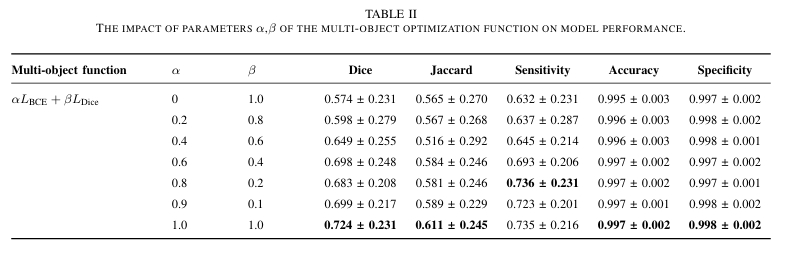
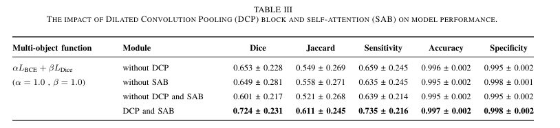
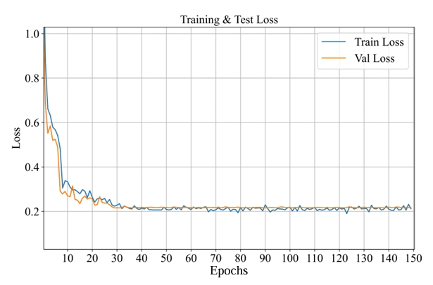
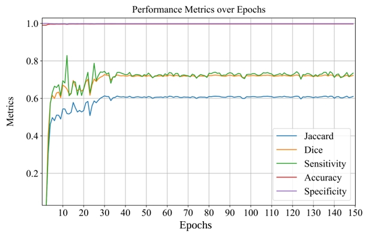

# DAHNet: Dilated Attention Hybrid Network for Intracerebral Hemorrhage Segmentation

DAHNet is a novel encoder-decoder architecture for th intracerebral hemorrhage segmentation.

## DAHNet Architecture


## Datasets

download the dataset: [ICH(Preprocessed)](https://pan.baidu.com/s/1sP5-daDsDdI0oBpoQFJ15A?pwd=qr7d) and[ICH (Original Dataset)](https://pan.baidu.com/s/1HNB0b6zH84yX25-InZ8C4w?pwd=uu5v).

more information refers to [Computed Tomography Images for Intracranial Hemorrhage Detection and Segmentation v1.3.1 (physionet.org)](https://physionet.org/content/ct-ich/1.3.1/)

## Configs

#### requires

Python 3.9

CUDA 12.2

PyTorch 1.8

#### training

```bash
python train.py
```

#### testing

```bash
python test.py
```

## Results (Qualitative results)







## Results (Qualitative results)






