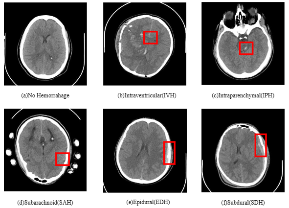
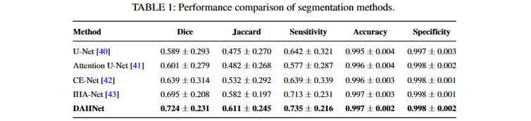
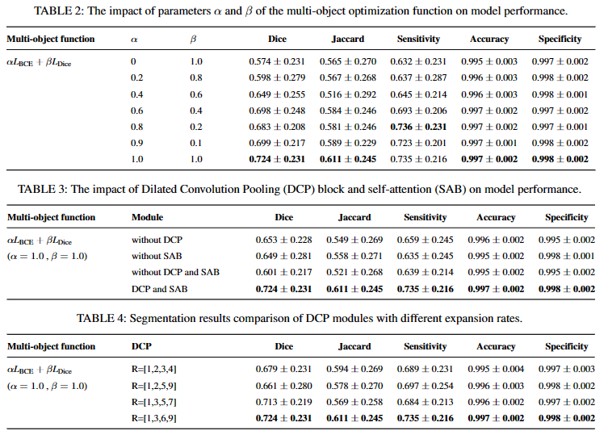
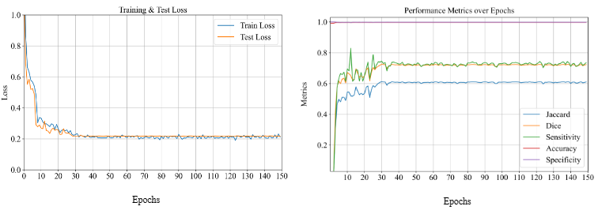

# DAHNet: Dilated Attention Hybrid Network for Intracerebral Hemorrhage Segmentation

DAHNet is a novel encoder-decoder architecture for th intracerebral hemorrhage segmentation.

## DAHNet Architecture


*FIGURE 1 The architecture of the proposed DAHNet.*

## Datasets

download the dataset: [ICH(Preprocessed)](https://pan.baidu.com/s/1sP5-daDsDdI0oBpoQFJ15A?pwd=qr7d) and[ICH (Original Dataset)](https://pan.baidu.com/s/1HNB0b6zH84yX25-InZ8C4w?pwd=uu5v).

more information refers to [Computed Tomography Images for Intracranial Hemorrhage Detection and Segmentation v1.3.1 (physionet.org)](https://physionet.org/content/ct-ich/1.3.1/)

The dataset includes with various types of cerebral hemorrhages, including intraventricular hemorrhage (IVH), parenchymal hemorrhage (IPH), subarachnoid hemorrhage (SAH), epidural hemorrhage (EDH), and subdural hemorrhage (SDH), as shown in the following figure.



*FIGURE 5: Images with the different types of ICH: (a) No Hemorrhage; (b) Intraventricular (IVH); (c) Intraparenchymal (IPH); (d) Subarachnoid (SAH); (e) Epidural (EDH); (f) Subdural (SDH).*

## Configs

#### requires

Python 3.9

CUDA 12.2

PyTorch 1.8

#### training

```bash
python train.py
```

#### testing

```bash
python test.py
```

## Results (Qualitative results)





## Results (Qualitative results)



*FIGURE 6: Training and test procedure. (left) The training and test loss for the proposed method; (right) The evaluation metrics used during the testing phase.*

---


*FIGURE 7: Visual segmentation results for small lesion cases. *
